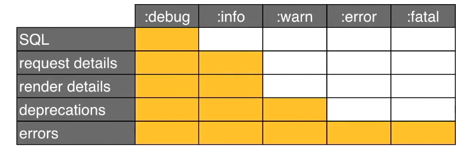

## V83 - Cookies 

1. They allow us to preserve "state" of the web app.
2. Web server sends data to the browser which then saves it in a cookie
3. Browser sends cookie data with each future request to the web server

- Cookies in rails work just like a hash of the values.
- Assigning value to a cookie 
  ```
  cookies[:username] = "meetmak" 

  cookies[:username] = {
    :value => "meetmak",
    :expires => 1.week.from_now 
  ```

- Limitations :
  - Max data size : 4Kb (~4000 chars) and the rest chars will be ignored.
  - Resides on user's computer
  - User can delete, read or alter the cookies. So cookies cant be always trusted by the web server as it can be altered by the user.

- Advice on usage :
  - Use to preserve state and save time.
  - Store only small pieces of data
  - Don't store model instances
  - Don't store sensitive data. 

---
## V84 - Sessions 

1. Designed to address the problem of preserving state of the web app
2. eb server sends a session ID  to the browser, which then the browser saves the session ID in a cookie of the browser.
3. Browser sends session ID with each future request to the web server.
4. Then the web server uses this session ID to locate the session file.
5. The session file has the data we want to store/process.
6. Session ID is not browser side but a server side entity which cannot be altered by the users.

- Using sessions is similar to cookies like using hash of the values 
  ```
  session[:username] = "meetmak"
  ```

- Limitations :
  - Requires timme to retireve the file using the session identifier. On a busy high traffic server the retrieval time will be noticable.
  - Session files accumulate on the server over time and it is upto the programmer tjo delete the old ones.
  - Session cookie resides on user's computer so it can be delted/hijacked. Like if the session ID gets in the hands od hacker then hacker can present itself like the actual user.

- Session Storage 
  1. File storage 
  2. Databse storage
  3. Cookie storage ( since rails 3 and default since then)

- Rails cookie storage
  1. "Super cookies"
  2. Fast and no lookup needed
  3. No setup required
  4. No file/DB bloat
  5. These super cookies are sent to the user's browser.
  6. Encrypted to prevent reading
  7. Cryptographically Signed to prevent tampering.
  8. Max size of 4Kb
  
- If dont want to use cookie storage then configure it 

---
## V85 - Controller filters (Controller callbacks)


1. Allow us to execute the code before/after a controller action.
2. Filter request before allowing actions
3. Remove code repetition
4. Perfor "housekeeping" tasks.(Setup/cleanup)

Uses : 

1. Confirm user authentication 
2. Set variables & default values needed by the templates.
3. Find database objects
4. Get shopping cart 
   
Methods :

1. before_action
2. after_action
3. around_action

- Any render/redirect methods inside the action method will prevent it's execution.
- Specify which actions activaye the filter with :
  ```
  :only => [:method1, :method3]
  :except => [:method2]
  ```
- Any filters defined in the `ApplicationController` are iherited by all the controllers.
- * All of the controllers are inherited from the `ApplicationController` class.
- Inherited filters can be skipped.
  1. skip_beore_action
  2. skip_after_action
  3. skip_around_action 

 1. Added before_action in the pages_controller.rb  

---

## V86 - Logging (Application logs)

- Log files used by rails 
- Log level configuration will be in the `config/environmen/` filees 
  - default is the `:debug` level for development.rb
  - 
- 5 log levels 
  1. `:debug` shows everything 
     1. errors
     2. deprecations
     3. render details about the templates 
     4. request details about the parameters that were sent 
     5. SQL which is composed.
  2. `:info` 
     1. Leaves the SQL part as it maybe a privacy concern 
  3. `:warn` 
     1. Only shows deprecations and errors ie. when things go wrong
  4. `:error` - shows recoverable errors
  5. `:fatal` - shows show stopping errors from recovering if not possible
  
- Can clear log files from the terminal using `rails log:clear` 
- Or can set up log rotations which automatically archives and clears the logs.
- Can write to the log files via the controller
```
logger.debug("The name is #(@subject.name}")

logger.info("Starting the subject update...") 

logger.warn("Invalid log in by #(params[:username]}") 

logger.error("Page #(params[:id]) not found") 

logger.fatal ("Necessary RubyGem not loaded")
```

Implementation :

1. Clear the log file by using the command `rails log:clear`.
2. Upon running the server, after doing some actions on the web app, corresponding logs are generated in that log file.
3. Changes config.log_level to `:warn` from `:debug`.
4. Tried adding a `loggr` to the subjectsController index def and the log was reflected succesfully in the console and log file.